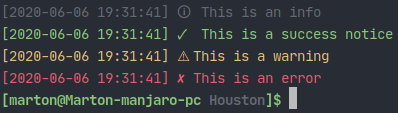
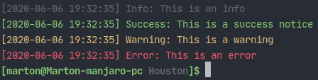
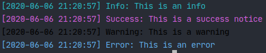
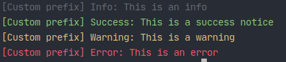
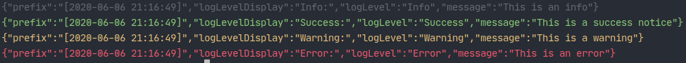

# Houston
An advanced [Deno](https://deno.land) logger, with no dependencies.

## Usage
You can create really simple or very advanced and complicated, informative logs with Houston.

### Importing the module
```ts
//you can import all required types, etc. from the mod.ts
import { Houston } from 'https://deno.land/x/houston/mod.ts'
```

### Creating a basic logger
For this you will also need to import the `ConsoleTransport` [transport](#transports) from `mod.ts`
```ts
const Logger = new Houston([

  new ConsoleTransport()

])
```
Here, we are basically creating a new logger for our project and initializing a new transport, a `ConsoleTransport`. You can read more about transports [here](#transports).

If you want to log something, you can easily do it depending on the level of your log:
```ts
//logging an info
Logger.log(LogLevel.Info, 'This is an info')

//logging a successful action
Logger.log(LogLevel.Success, 'This is a success notice')

//logging a warning
Logger.log(LogLevel.Warning, 'This is a warning')

//logging an error
Logger.log(LogLevel.Error, 'This is an error')
```

## API
As explained above, we can use the `Houston` instance to create a new logger. You can read about it's configuration below.

### Transports
Transports are different methods of logging. You need can add them to your logger by including one when initializing

|   Transport name       |   Description |
|------------------------|---------------|
|   ConsoleTransport     |  This transport will log the desired messages to the command line, with additional options   |
|   FileTransport [W.I.P]|  This transport will save your logs in a file    |
|   WebTransport [W.I.P] |  This transport will send `PUT` requests containing you logs, to save on an external server  |

### Config
The config is a set of custom options that modify the way your logs look. You can also use them with the transports, when adding one to the `Houston` instance

All the required types can be imported from `mod.ts`

A full config object with all properties looks like this:
```ts
{

    format: Format.text,
    prefix: new TimePrefix(),
    logLevelDisplay: LogLevelDisplay.Text,
    logColors: {
    
        [LogLevel.Info]: Color.White,
        [LogLevel.Success]: Color.Green,
        [LogLevel.Warning]: Color.Yellow,
        [LogLevel.Error]: Color.Red
    
    }

}
```

#### `format: Format`
The format of the logs. Can be `text` or `json`

`format: Format.json`

#### `prefix: Prefix`
The prefix of your logs. Can be `TimePrefix` (prints the time), `TextPrefix` (a custom prefix by you) or `NoPrefix` (no prefix before logs)

You can also create your own `Prefix` implementation by importing `Prefix` from `main.ts` and extending it.

###### Modifying the `TimePrefix` date format
You can set the used time format for the `TimePrefix` to `TimeFormat.American` or `TimeFormat.European`

`prefix: new TimePrefix(TimeFormat.American)`

###### The `TextPrefix` prefix
You can apply a custom text like this:

`prefix: new TextPrefix('Your prefix')`

#### `logLevelDisplay: LogLevelDisplay`
You can customize what to display before the log message. This can be `LogLevelDisplay.Text` (prints the level of the log), `LogLevelDisplay.Icon` (prints an icon) or `LogLevelDisplay.Hidden` (no log level displaying).

`LogLevelDisplay.Icon`

#### `logColors: Record<LogLevel, Color>`
The colors of the different log levels. All fields are required, if you want to change one

```ts
logColors: {

    [LogLevel.Info]: Color.White,
    [LogLevel.Success]: Color.Green,
    [LogLevel.Warning]: Color.Yellow,
    [LogLevel.Error]: Color.Red

}
```

### Passing config to transports
```ts
const Logger = new Houston([

  new ConsoleTransport(

    //adding log levels
    [LogLevel.Info, LogLevel.Success, LogLevel.Warning, LogLevel.Error],
    
    //passing a config
    { logLevelDisplay: LogLevelDisplay.Icon }
  
  )

])
```
If you don't pass a config to the transport, it will use the default config, determinated by the `Houston` instance

## Screenshots
`LogLevelDisplay.Icon`



`LogLevelDisplay.Text`



Custom colors



`new TextPrefix('Custom prefix')`



`Format.json`

